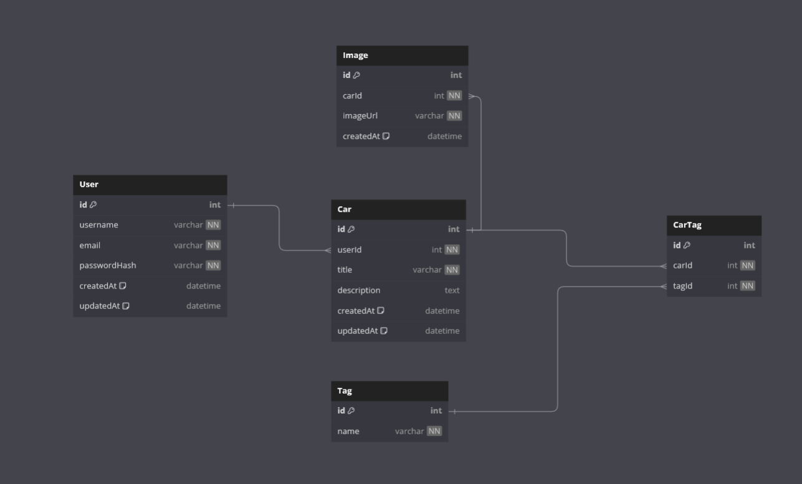

## Db Diagram

##API Endpoints
- POST /api/users: Create a user (sign-up).
- POST /api/login: Authenticate a user.
- POST /api/cars: Create a car with title, description, tags, and up to 10 images.
GET /api/cars: Retrieve the list of cars for the logged-in user.
GET /api/cars/search?query=keyword: Global search across user's cars (title, description, tags).
GET /api/cars/{car_id}: Retrieve details for a specific car.
PUT /api/cars/{car_id}: Update title, description, tags, and images for a specific car.
DELETE /api/cars/{car_id}: Delete a specific car.